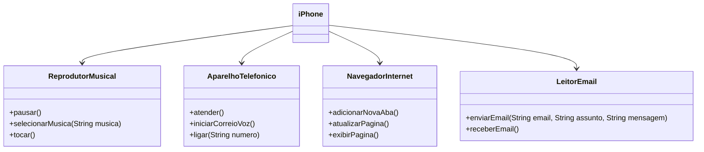

### Projeto de implementação do iPhone em UML e Java

```mermaid
classDiagram
    class ReprodutorMusical {
        +pausar()
        +selecionarMusica(String musica)
        +tocar()
    }

    class AparelhoTelefonico {
        +atender()
        +iniciarCorreioVoz()
        +ligar(String numero)
    }

    class NavegadorInternet {
        +adicionarNovaAba()
        +atualizarPagina()
        +exibirPagina()
    }

    class LeitorEmail {
        +enviarEmail(String email, String assunto, String mensagem)
        +receberEmail()
    }

    class iPhone {
    }

    iPhone --> ReprodutorMusical
    iPhone --> AparelhoTelefonico
    iPhone --> NavegadorInternet
    iPhone --> LeitorEmail
```
